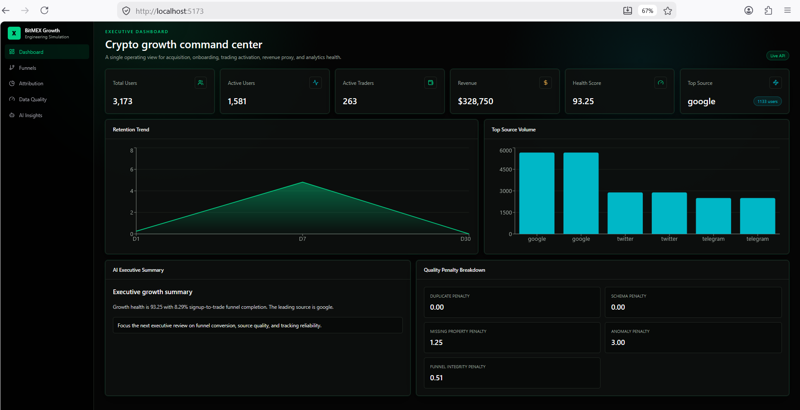
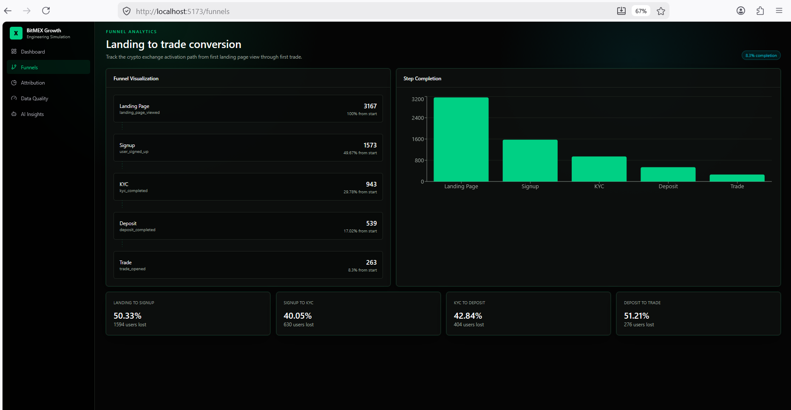
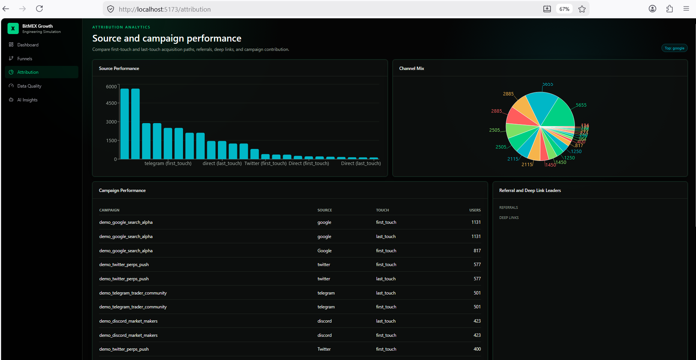
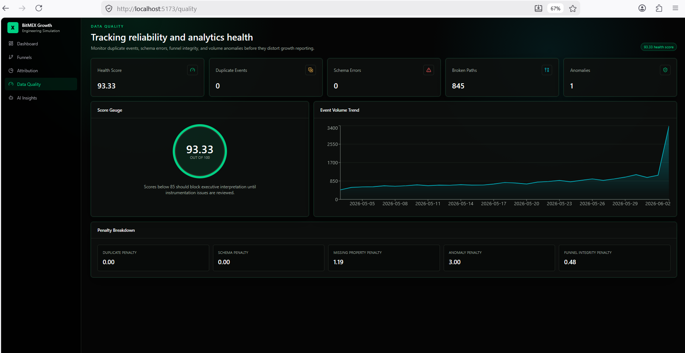
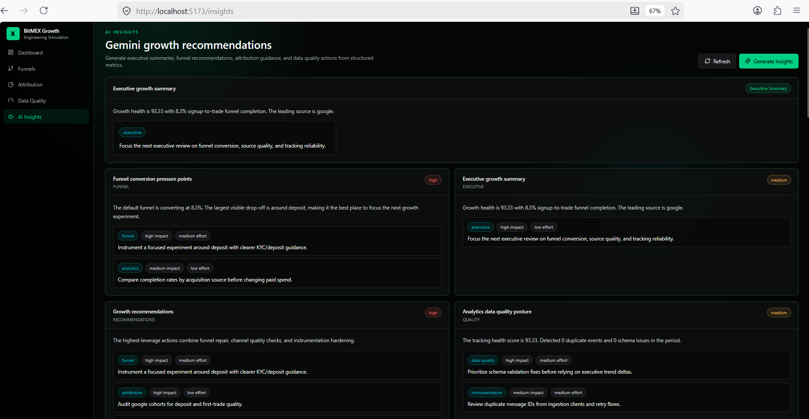

# BitMEX Growth Engineering Simulation

A production-inspired Growth Engineering Analytics Platform built to simulate the responsibilities of a BitMEX Growth Engineer.

The platform transforms raw user activity into actionable growth intelligence through:

* Segment-style Event Tracking
* Funnel Analytics
* Attribution Modeling
* Data Quality Monitoring
* Gemini AI Recommendations
* Executive Growth Dashboards

---

# Features

## Event Tracking

Track and validate:

* User Signup
* KYC Flow
* Deposits
* Trading Activity
* Referrals
* Campaign Activity

---

## Funnel Analytics

Analyze:

Landing Page

↓

Signup

↓

KYC

↓

Deposit

↓

Trade

Metrics:

* Conversion Rate
* Completion Rate
* Funnel Dropoff

---

## Attribution Analytics

Supports:

* Google
* Twitter/X
* Telegram
* Discord
* Referral
* Direct

Capabilities:

* First Touch Attribution
* Last Touch Attribution
* Campaign Analysis
* Deep Link Tracking
* Referral Tracking

---

## Data Quality Monitoring

Monitor:

* Duplicate Events
* Schema Violations
* Missing Properties
* Funnel Integrity
* Event Anomalies

Produces:

* Data Health Score
* Quality Recommendations

---

## Gemini AI Insights

Powered by:

Gemini 2.5 Flash

Generates:

* Executive Summaries
* Funnel Recommendations
* Attribution Recommendations
* Data Quality Recommendations

---

# Architecture

```text
Frontend (React + TypeScript)
           ↓
Backend (FastAPI)
           ↓
Event Tracking Engine
           ↓
Analytics Engine
           ↓
Attribution Engine
           ↓
Data Quality Engine
           ↓
Gemini AI Insights
           ↓
PostgreSQL
```
---

# Frontend Setup

Requirements:

* Node.js 20+
* npm

Install dependencies:

```bash
cd frontend
npm install
```

Copy environment file:

```bash
copy .env.example .env
```

Run development server:

```bash
npm run dev
```

or

```bash
npm.cmd run dev
```

Frontend URL:

```text
http://localhost:5173
```

---

# Backend Setup

Requirements:

* Python 3.12+
* PostgreSQL 15+
* Redis 7+

Create virtual environment:

```bash
cd backend

python -m venv .venv
```

Activate environment:

Windows:

```powershell
.venv\Scripts\activate
```

Linux/macOS:

```bash
source .venv/bin/activate
```

Install dependencies:

```bash
pip install -r requirements.txt
```

Copy environment file:

```bash
copy .env.example .env
```

Update:

```env
GEMINI_API_KEY=YOUR_GEMINI_API_KEY
```

Run migrations:

```bash
alembic upgrade head
```

# Generate Seed Demo Data (1000 Records)

```bash
python seed_demo_data_1000_records.py
```

Start server:

```bash
uvicorn app.main:app --reload --host 0.0.0.0 --port 8000
```

Backend URL:

```text
http://localhost:8000
```

Swagger:

```text
http://localhost:8000/api/v1/docs
```

---

# Testing

Refer:

```text
TESTING.md
```

The testing guide contains:

* Event Tracking Examples
* Funnel Testing
* Attribution Testing
* Data Quality Testing
* AI Insights Testing

---

# Technology Stack

Backend

* FastAPI
* SQLAlchemy
* Alembic
* PostgreSQL
* Redis

Frontend

* React
* TypeScript
* Vite
* TailwindCSS
* ShadCN UI
* Recharts

AI

* Gemini 2.5 Flash

Infrastructure

* Docker Ready
* Terraform Ready

---

# Screenshots

## Executive Dashboard

Displays:



* Total Users
* Active Users
* Active Traders
* Revenue
* Health Score
* Top Acquisition Source

## Funnel Analytics

Shows:



* Landing → Signup → KYC → Deposit → Trade
* Conversion Rates
* Dropoff Metrics

## Attribution Analytics

Shows:



* Source Performance
* Campaign Performance
* Referral Metrics
* Deep Link Metrics

## Data Quality

Shows:



* Health Score
* Duplicates
* Anomalies
* Schema Errors

## AI Insights

Shows:



* Executive Summaries
* Growth Recommendations
* Attribution Recommendations
* Data Quality Recommendations

---

# Author

Mahesh Kumar Sahoo

AI/ML Engineer | Data Engineer | Backend Engineer | GenAI Engineer

🔗 Portfolio
https://mahesh-kumar-sahoo-l2r2hqb.gamma.site/

🔗 LinkedIn
https://www.linkedin.com/in/mahesh-sahoo-ai-data-engineer

🔗 GitHub
https://github.com/Msahoo876
